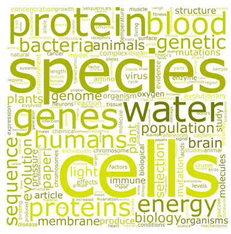

<!--

The paper.md, bibtex and figure file can be found in this repo:

  https://github.com/journal-of-research-objects/Example-BioHackrXiv-Paper

To modify, please clone the repo. You can generate PDF of the paper by
pasting above link (or yours) in

  http://biohackrxiv.genenetwork.org/

-->

# Introduction

The use of ontology terms can make data more FAIR and tractable by machines. However, the highly formalised terminology used by these ontology terms does not always match the colloquial language used by practitioners. This disparity can (a) make it difficult for practitioners to understand the language used by knowledge stored in ontologies; and (b) make it difficult to machine-interpret information written by practitioners to map it to ontologies.

This problem is particularly relevant in the ELIXIR Microbial Biotechnology (MB) community, as although the domain has adopted ontologies and data standards such as SO, SBO, GO, and SBOL for data representation, the tools developed often use ontology terms directly rather than the language used in the wet lab (i.e. by the people using the tools.)

At the BioHackathon 2022 in Paris, France, we initiated an effort to address this problem by (a) mining the internet for colloquial language used by biologists, (b) constructing a dictionary of this language and its mappings to ontology terms, and (c) constructing a recommendation table of terminology for MB tool developers based on this data.

While initially developed to serve the MB community, we hope that the dictionary will serve as a helpful resource for anyone hoping to map from colloquial wet lab language to ontology terms for e.g. text mining applications.

# Using Stack Exchange to gather colloquial domain language

Biology Stack Exchange is a forum where colloquial language is used to ask and answer questions throughout the domain. We took the data available at <data dump location::date> and extracted the words in the posts and comments to count up the frequency in which each word is used. To remove commonly used words and words that are non-specific to biology, we performed the same exercise on Meta Stack Exchange and subtracted the most commonly used words on the Meta dataset from the Biology dataset. This resulted in a set of words that were commonly used on the Biology Stack Exchange and the frequency in which each word appeared. We used this to generate a wordcloud.

# Creating a dictionary of colloquial wet lab terminology

An issue we encountered in making the dictionary available is that there is no standard/FAIR data format to publish string to term mappings. The SSSOM (Super Simple Standard for Ontology Mappings) supports term to term mappings, but not string to term. We have discussed with the SSSOM developers about implementing support for this, and are helping with a pull request to add it to the standard. We will then hopefully be able to publish the dictionary in the future using SSSOM.
  
The table below shows an example of some of these terms and how they map to ontology terms.

| Name | Type | Domain | Description | Ontology Mapping | Wikipedia reference |
|:----------:|:-----:|:--------:|:----------------------:|:--------------:|:---------:|
| Silencing | verb | Biology | Inhibiting the expression of a gene | GO:0010629 "negative regulation of gene expression" | [Gene_silencing](https://en.wikipedia.org/wiki/Gene_silencing) |
| Transformation | verb | Molecular Biology | Transferring genetic material into a cell. Typically, uptake of a plasmid into a cell or population of cells. | EFO:0000726 "transfection" | [Transformation_(genetics)](https://en.wikipedia.org/wiki/Transformation_(genetics)) |
| RBS | noun | Molecular Biology | Sequence that a ribosome recognises and attaches at to initiate translation | SO:0000139 "ribsome entry site" | [Ribosome-binding_site](https://en.wikipedia.org/wiki/Ribosome-binding_site) |
| Restriction Site | noun | Molecular Biology | The recognition sequence of a specific restriction enzyme | SO:0001687 "restriction enzyme recognition site" | [Restriction_site](https://en.wikipedia.org/wiki/Restriction_site) |
| Digestion | verb | Molecular Biology | Using a restriction enzyme to cut a DNA sequence at a specific location (a restriction site) | GO:0015666 "restriction endodeoxyribonuclease activity" | [Restriction_digest](https://en.wikipedia.org/wiki/Restriction_digest) |
| Plate | verb | Microbiology | Put cells on solid media for growing | N/A | [Inoculation](https://en.wikipedia.org/wiki/Inoculation) |
| Plate | noun | Microbiology | Labware containing solid growth media | N/A | [Petri_dish](https://en.wikipedia.org/wiki/Petri_dish) |
| Downregulate | verb | Molecular Biology | Negatively influence gene expression | GO:0010629 "negative regulation of gene expression" | [Downregulation_and_upregulation](https://en.wikipedia.org/wiki/Downregulation_and_upregulation) |
| Upregulate | verb | Molecular Biology | Positively influence gene expression | GO:0010628 "positive regulation of gene expression" | [Downregulation_and_upregulation](https://en.wikipedia.org/wiki/Downregulation_and_upregulation) |

# Terminology recommendations for Microbial Biotechnology tool developers
This list is non-exhaustive, but covers a selection of terms that we noticed differ between MB tools.

| Term                | MB tools/ontologies using this term | Frequency on Biology Stack Exchange | Search Term         |
|:-------------------:|:-----------------------------------:|:-----------------------------------:|:-------------------:|
| Part | iGEM | 9065 | part + parts |
| Component           | SBOL, SBOLDesigner, SBOLCanvas      | 2163                                | component           |
| Module              | SBOL                                | 311                                 | module              |
| Device              |                                     | 677                                 | device              |
| System              |                                     | 16098                               | system              |
| RBS                 |                                     | 548                                 | rbs                 |
| Ribosome Entry Site | SO                                  | 8                                   | ribosome entry site |
| Restriction Enzyme Recognition Site | SO | 0 | restriction enzyme recognition site |
| RERS | SBOLCanvas | 0 | rers|
| Restriction Site | | 52 | restriction site |
| Upregulation        |                                     | 216                                 | upreg*              |
| Downregulation      |                                     | 195                                 | downreg*            |
| Stimulation | SBO, SBOLCanvas | 1666 | stimulat* |
| Inhibition | SBO, SBOLCanvas | 3879 | inhibit* |
| Positive Regulation | GO | 17 | positive reg* + positively reg* |
| Negative Regulation | GO                                  | 36                                  | negative reg* + negatively reg* |
| Role | SBOLDesigner | 2068 | role |
| Function | | 3567 | function |
| Backbone | SBOLCanvas | 444 | backbone |
| Vector | | 1608 | vector |
| Plasmid | | 3026 |
| Host | | 2507 | host + hosts |
| Chassis | | 3 | chassis + châssis|

<!-- ![Table 1 - TEST]
  A table Caption here would be delightful, how do we do this?
-->

This data was collected by searching for strings within the Posts and Comments XML files (ignoring case sensitivity). There are issues with this methodology due to variations or typos in the way that this language may be used. Additionally, if punctuation was used before or after the word, it may not be included in the result due to the insertion of spaces in our search terms to account for prefixes and suffixes. This data is also prone to a lack of context. For example, the term "system" may be used in Engineering Biology to mean a genetic circuit but "system" is commonly used for other meanings. In future, a more robust approach could be used but this data provides an initial investigation into the use of some choice terminology.

# Results

<!--
    State the problem you worked on
    Give the state-of-the art/plan
    Describe what you have done/results starting with The working group created...
    Write a conclusion
    Write up any future work

-->

The following tasks were accomplished as part of the BioHackathon:

- Initial Dictionary of Terms in CSV fomrat
- Analysis of commonly used words on Stack Exchange

# Availability

The dictionary is available in CSV format at 

# Future work

We have used the Stack Exchange dataset to analyse the popularity of a small set of terms used in MB which differ between different tools. The next step would be to apply this to entire ontologies, annotating every label and synonym in the ontology with its popularity. This information could then be used to inform whether the primary label of the term should be preferred, or whether a synonym should be preferred instead.

It would also be interesting to explore how the Stack Exchange datasets can be used to gather domain-specific language for different domains, using a similar approach subtracting “meta” terms and analysing the delta. There are 98 Stack Exchange sites at the time of writing.

We intend to publish the dictionary using SSSOM, once the ability to map strings to terms has been implemented.

## Acknowledgements

With thanks to the oranisers of BioHackathon Europe for
providing an excellent environment to inspire this work
and for funding the travel arrangements of the authors.

## References

\begin{tabular}{ |p{3cm}|p{3cm}|p{3cm}|  }
\hline
\multicolumn{3}{|c|}{Country List} \\
\hline
Country Name or Area Name& ISO ALPHA 2 Code &ISO ALPHA 3 \\
\hline
American Samoa & AS & ASM \\
\hline
Andorra & AD & AND   \\
\hline
Angola & AO & AGO \\
\hline
\end{tabular}
  
  
